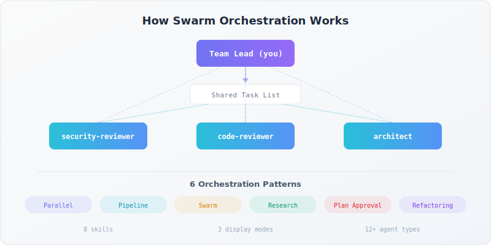

<picture>
  <source media="(prefers-color-scheme: dark)" srcset=".github/social-preview-dark.svg">
  <source media="(prefers-color-scheme: light)" srcset=".github/social-preview.svg">
  
</picture>

[](LICENSE)
[](https://code.claude.com/docs/en/plugins)
[](https://code.claude.com/docs/en/agent-teams)
[](CHANGELOG.md)
[](https://arxiv.org/abs/2512.24601)

Multi-agent orchestration plugin for [Claude Code](https://claude.com/claude-code). Coordinate teams of agents with shared tasks, inter-agent messaging, and proven patterns for parallel reviews, pipelines, self-organizing swarms, and large-file analysis via the [RLM pattern](https://arxiv.org/abs/2512.24601).

**Official docs:** [Agent Teams](https://code.claude.com/docs/en/agent-teams)

<p align="center">
  
</p>

---

## Prerequisites

Before installing, make sure you have:

### Claude Code CLI

Install and authenticate Claude Code. See the [quickstart guide](https://code.claude.com/docs/en/quickstart).

```bash
claude --version   # Verify installed, must be 1.0.33+
```

### Enable Agent Teams

Agent teams are experimental and disabled by default. Enable them by adding this to your `settings.json`:

```json
{
  "env": {
    "CLAUDE_CODE_EXPERIMENTAL_AGENT_TEAMS": "1"
  }
}
```

Or set the environment variable directly:

```bash
export CLAUDE_CODE_EXPERIMENTAL_AGENT_TEAMS=1
```

### tmux (recommended)

Split-pane mode lets you see all teammates working side-by-side. It requires `tmux`.

**macOS:**
```bash
brew install tmux
```

**Linux (Debian/Ubuntu):**
```bash
sudo apt install tmux
```

**Why tmux?** Background agents need terminal multiplexing to run in visible, persistent panes. Without tmux, agents run in-process (invisible but functional). See [docs/getting-started.md](docs/getting-started.md) for details on display modes.

### iTerm2 (optional, macOS only)

If you use iTerm2, install the `it2` CLI for native split panes:

```bash
uv tool install it2
# Then: iTerm2 -> Settings -> General -> Magic -> Enable Python API
```

---

## Installation

### From GitHub

```bash
claude /plugin install https://github.com/zircote/claude-team-orchestration
```

### From local directory

Clone the repo and load it directly:

```bash
git clone https://github.com/zircote/claude-team-orchestration.git
claude --plugin-dir ./claude-team-orchestration
```

### Verify installation

Start Claude Code and run:

```
/help
```

You should see swarm skills listed under the `swarm:` namespace:

```
swarm:orchestrating
swarm:team-management
swarm:task-system
swarm:messaging
swarm:agent-types
swarm:orchestration-patterns
swarm:spawn-backends
swarm:error-handling
swarm:rlm-pattern
```

### Troubleshooting setup

| Problem | Fix |
|---------|-----|
| Skills don't appear | Restart Claude Code after installing |
| `swarm:` prefix missing | Verify `.claude-plugin/plugin.json` exists in the plugin directory |
| Agent teams not working | Check `CLAUDE_CODE_EXPERIMENTAL_AGENT_TEAMS` is set to `1` |
| Split panes not showing | Run `which tmux` to verify tmux is installed |

---

## Quick Start

Here's a minimal example that spawns a parallel code review team with three specialists:

```
Create an agent team called "review" to review the src/ directory.
Spawn three reviewers in parallel:
- "security" using sdlc:security-reviewer — check for vulnerabilities
- "quality" using feature-dev:code-reviewer — check for bugs and performance
- "simplicity" using code-simplifier:code-simplifier — check for unnecessary complexity

Have each reviewer send findings to team-lead when done.
Synthesize all findings into a summary, then shut down the team.
```

**What success looks like:**

1. Claude creates the team and spawns three agents
2. Each agent reviews the code through its own lens (in parallel)
3. Findings arrive as messages to the team lead
4. The lead synthesizes a unified report
5. The team shuts down cleanly

For more examples, see [docs/patterns.md](docs/patterns.md) and [skills/orchestration-patterns/examples/complete-workflows.md](skills/orchestration-patterns/examples/complete-workflows.md).

---

## Skills Reference

All skills are available under the `swarm:` namespace.

| Skill | Command | Description |
|-------|---------|-------------|
| [Orchestrating](skills/orchestrating/SKILL.md) | `swarm:orchestrating` | Primitives overview, lifecycle, quick reference. Start here. |
| [Team Management](skills/team-management/SKILL.md) | `swarm:team-management` | Create teams, spawn teammates, delegate mode, permissions, shutdown, cleanup |
| [Task System](skills/task-system/SKILL.md) | `swarm:task-system` | Create tasks, set dependencies, claim work, track progress |
| [Messaging](skills/messaging/SKILL.md) | `swarm:messaging` | Direct messages, broadcasts, shutdown requests, plan approvals |
| [Agent Types](skills/agent-types/SKILL.md) | `swarm:agent-types` | Built-in and plugin agents, selection guide, capabilities |
| [Orchestration Patterns](skills/orchestration-patterns/SKILL.md) | `swarm:orchestration-patterns` | 7 patterns: parallel specialists, pipelines, swarms, research+implement, plan approval, refactoring, RLM |
| [Spawn Backends](skills/spawn-backends/SKILL.md) | `swarm:spawn-backends` | In-process, tmux, iTerm2 backends, auto-detection, configuration |
| [Error Handling](skills/error-handling/SKILL.md) | `swarm:error-handling` | Common errors, quality gate hooks, known limitations, recovery strategies |
| [RLM Pattern](skills/rlm-pattern/SKILL.md) | `swarm:rlm-pattern` | Content-aware chunked analysis of large files and directories using RLM pattern |

---

## Documentation

| Guide | Description |
|-------|-------------|
| [Getting Started](docs/getting-started.md) | End-to-end walkthrough from install to first team run |
| [Agent Types](docs/agent-types.md) | Which agents are available and when to use each |
| [Patterns](docs/patterns.md) | Orchestration patterns with guidance on when to pick which |
| [RLM Examples](docs/rlm-examples.md) | Copy-paste example prompts for every RLM mode |
| [Troubleshooting](docs/troubleshooting.md) | Common failures and fixes |

---

## Attribution

This plugin is based on the [Claude Code Swarm Orchestration Skill](https://gist.github.com/kieranklaassen/4f2aba89594a4aea4ad64d753984b2ea) by [@kieranklaassen](https://github.com/kieranklaassen). The original monolithic gist has been decomposed into modular, maintainable skills that can be independently loaded, updated, and extended.
