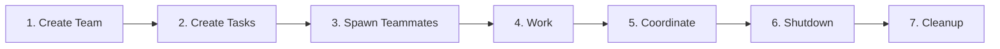

# Concepts

How the swarm orchestration system works. This document explains the mechanics behind teams, patterns, and RLM content processing.

---

## Team Lifecycle

Every team follows a seven-step lifecycle:



1. **Create Team** — `TeamCreate` creates a team with a shared task list. A team config file is written to `~/.claude/teams/{name}/config.json` and a task directory is created at `~/.claude/tasks/{name}/`.
2. **Create Tasks** — The leader creates work items with `TaskCreate`. Each task has a subject, description, status, and optional dependencies on other tasks.
3. **Spawn Teammates** — The leader spawns agents into the team using `Task` with `team_name` and `name` parameters. Each teammate gets an inbox for messaging and can access the shared task list.
4. **Work** — Teammates claim tasks from the shared list, update status to `in_progress`, and do the work. Each teammate operates independently with its own context.
5. **Coordinate** — Agents communicate via `SendMessage`. The leader receives findings, reassigns work, and unblocks stuck teammates. Idle notifications fire automatically when teammates finish their current turn.
6. **Shutdown** — The leader sends `shutdown_request` messages to each teammate. Teammates respond with `shutdown_response` (approve or reject). Teammates finish their current request before exiting.
7. **Cleanup** — Once all teammates have shut down, the leader calls `TeamDelete` to remove the team config and task directories.

> See [Getting Started](getting-started.md#6-run-your-first-team) for a hands-on walkthrough.

---

## How Each Pattern Works

The seven orchestration patterns each solve a different coordination problem. For usage examples and prompts, see [Patterns](patterns.md).

### Parallel Specialists

Multiple specialists work simultaneously, each with a different focus area.

1. Create team, spawn specialists in parallel
2. Each reviews independently through its own lens
3. Findings arrive as messages to the lead
4. Lead synthesizes into unified report
5. Shutdown and cleanup

### Pipeline

Each stage depends on the previous. Work flows linearly through phases.

1. Create team and all tasks upfront
2. Set task dependencies: #2 blocked by #1, #3 blocked by #2, etc.
3. Spawn all workers at once — they'll wait for their dependencies
4. As each task completes, the next auto-unblocks
5. Workers claim and complete newly available tasks

### Swarm

Workers grab available tasks from a shared pool. Self-organizing, naturally load-balancing.

1. Create team and a task for each work item (no dependencies)
2. Spawn N workers with identical prompts: "check TaskList, claim next pending task, do it, repeat"
3. Workers race to claim tasks — file locking prevents double-claims
4. Each worker processes multiple tasks, naturally balancing load
5. When no tasks remain, workers go idle

### Research + Implementation

Research first, then implement using findings. Clean phase separation without a full team.

1. Spawn a research agent (synchronous, returns result)
2. Feed research findings into the implementation prompt
3. Spawn an implementation agent with the enriched prompt

This pattern uses sequential subagents, not a full team. The research result flows directly into the implementation prompt.

### Plan Approval

Require a teammate to plan before implementing. The lead reviews and approves or rejects.

1. Create team, spawn teammate with `mode: "plan"`
2. Teammate works in read-only mode, designing the plan
3. Teammate sends a `plan_approval_request` to the lead
4. Lead reviews and approves or rejects with feedback
5. If rejected, teammate revises and resubmits
6. Once approved, teammate exits plan mode and implements

### Multi-File Refactoring

Coordinated changes across multiple files with fan-in dependencies.

1. Create team and tasks with fan-in dependencies (#3 blocked by #1 AND #2)
2. Spawn workers for each task
3. Independent tasks run in parallel
4. Dependent tasks auto-unblock when all blockers complete
5. Final worker validates the integrated changes

### RLM (Recursive Language Model)

Divide large files into partitions, analyze each with parallel analyst agents, then synthesize.

1. Team lead detects content type per file and determines partitioning strategy
2. Team lead divides content into chunks (code: function boundaries, CSV: row splits with header, JSON: element splits, logs: line ranges)
3. Content-type-specific analyst agents analyze partitions in parallel
4. Each analyst reports structured findings back to team lead
5. Team lead (or a dedicated synthesizer agent) combines all reports
6. Shutdown and cleanup

---

## RLM Content Processing

The RLM pattern auto-detects content types and applies type-specific processing strategies. This section explains what happens internally for each content type. For copy-paste prompts, see [RLM Examples](rlm-examples.md).

### Content Type Detection

RLM identifies content types using file extensions (primary) and content sniffing (fallback). Extension mapping covers common types: `.py`, `.ts`, `.rb` map to `source_code`; `.csv`, `.tsv` to `structured_data`; `.json`, `.jsonl` to `json`; `.log`, `.txt` to `log`/`prose`. When the extension is ambiguous (e.g., a `.txt` file containing CSV data), you can override by mentioning the content type in your prompt.

### Basic (Logs and Prose)

For log files and text documents:

1. Detects content type (`log` or `prose`)
2. Splits into ~5-10 chunks by line ranges (with overlap for logs)
3. Spawns 1 `swarm:rlm-chunk-analyzer` agent per chunk (Haiku), each with fresh context
4. Each analyst processes its pre-assigned chunk (1 analyst per partition, staged spawning for large workloads)
5. Synthesizes all findings into a consolidated report

### Source Code

For source files with function/class structure:

1. Detects `source_code` from file extension
2. Scans for function/class boundaries at indentation level 0
3. Chunks at semantic boundaries (150-300 lines per chunk)
4. Prepends the file's import block to every chunk for dependency context
5. Spawns `swarm:rlm-code-analyzer` agents with the specified analysis focus
6. Findings include scope context like `function:process_payment` and severity levels

### CSV/TSV

For structured tabular data:

1. Detects `structured_data` from `.csv` extension
2. Reads the header row and preserves it in every chunk
3. Splits by row count (~2000 rows per chunk for narrow data, ~500-1500 for wide data with 20+ columns)
4. Spawns `swarm:rlm-data-analyzer` agents — column-aware, reports distributions and statistics
5. Findings are aggregatable: the synthesizer sums counts across chunks

### JSON/JSONL

For JSON documents and JSONL streams:

1. Detects `json` or `jsonl` from extension (or by content sniffing)
2. For JSON: splits top-level array into valid sub-arrays (200-500 elements per chunk)
3. For JSONL: splits by line count (500-1000 lines per chunk)
4. Injects a schema summary (field names + types) into each analyst's prompt
5. Spawns `swarm:rlm-json-analyzer` agents — schema-aware, reports field distributions and type consistency
6. Detects schema drift (objects with different shapes within the same dataset)

### JSONL Log Analysis

A specialization of JSON/JSONL RLM for log files with automated schema discovery:

1. Runs `wc -l` to count lines, then `head -20 | jq` to extract every unique field path with types
2. Samples the tail (if >1000 lines) to detect schema drift
3. Classifies fields by log-relevant category (timestamp, level, error, identifier, message, status, source)
4. Generates tailored jq recipes from the discovered schema (filter by level, extract errors, count by status, etc.)
5. Partitions the file by line count (500-1000 lines/chunk) and creates one task per chunk
6. Spawns `swarm:rlm-json-analyzer` agents with schema summary + jq recipes in each prompt
7. Synthesizes findings with log-specific guidance (temporal patterns, error clustering, service breakdown)

### Directory and Multi-Type Analysis

For directories containing multiple files:

1. Enumerates and classifies every file by content type (extension + content sniffing)
2. Groups files by type and applies per-type partitioning strategies
3. Allocates a data-driven partition budget with tiered sizing:
   - Small files (<=1500 lines): batched together, no splitting
   - Medium files (1501-5000 lines): partitioned using content-type chunk targets
   - Large files (>5000 lines): partitioned using content-type chunk targets (scales with file size)
4. Batches small same-type files together to reduce task count
5. Spawns mixed analyst types simultaneously (up to 4 different types, scaled to task volume)
6. Analysts write findings to task descriptions (not messages) to protect team lead context
7. **Phase 1 synthesis**: per-type summaries in parallel
8. **Phase 2 synthesis**: cross-type final report correlating findings across file types

---

## Cross-File Analysis

Multi-type directory analysis detects things single-file analysis cannot:

- Config values referenced in code that don't match
- Data schemas in JSON that diverge from CSV column structures
- Hardcoded values in code that should come from config
- Test fixtures that don't match production data patterns
- Naming inconsistencies across file types

---

## Task Dependencies

Tasks can depend on other tasks using `addBlockedBy`. A blocked task stays in `pending` status until all of its blockers are marked `completed`, at which point it auto-unblocks and becomes available for claiming.

**Linear chains** model pipelines — each stage waits for the previous:

```
#1 Research → #2 Implement → #3 Test → #4 Deploy
```

**Fan-in dependencies** model convergence points — a task waits for multiple predecessors:

```
#1 Refactor Model  ──┐
                     ├──→ #3 Integration Tests
#2 Refactor Controller ┘
```

Set fan-in with `TaskUpdate({ taskId: "3", addBlockedBy: ["1", "2"] })`. Task #3 won't unblock until both #1 and #2 are completed.

Fan-in is the mechanism behind the Multi-File Refactoring and RLM synthesis patterns — independent work runs in parallel, then a final task waits for all of them to finish before synthesizing.
