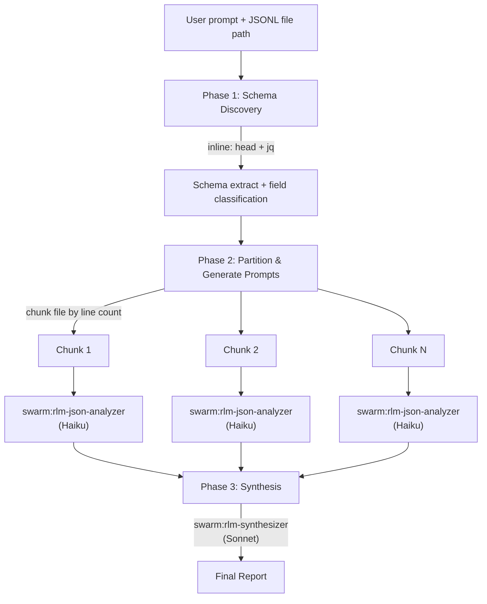

# JSONL Log Analyzer

Automated schema-aware analysis of large JSONL log files. Discovers the field schema dynamically, generates tailored jq extraction recipes, and orchestrates the standard RLM fan-out/fan-in pipeline — making JSONL log analysis a single-prompt operation.

**Related skills:**
- [RLM Pattern](/skills/rlm-pattern/) — Core chunked analysis pattern this skill builds on
- [Orchestration Patterns](/skills/orchestration-patterns/) — Pattern 7 (RLM) and team lifecycle

---

## Architecture



Three phases:
1. **Schema Discovery** — Extract field paths, types, and presence counts using `head`/`tail` + `jq`. No raw log lines enter the orchestrator's context.
2. **Partition & Generate Prompts** — Split the file by line count, generate per-chunk analyst prompts with schema summary and tailored jq recipes.
3. **Synthesis** — Aggregate analyst findings into a coherent report with log-specific guidance (temporal patterns, error clustering, service breakdown).

---

## When to Use

| Scenario | Use This Skill? |
|----------|----------------|
| Large JSONL log file (&gt;1500 lines) | Yes |
| Incident investigation in structured logs | Yes |
| Traffic/request analysis from JSONL event streams | Yes |
| JSONL files with unknown or evolving schema | Yes |
| Plain text logs (unstructured) | No — use basic RLM with `swarm:rlm-chunk-analyzer` |
| Small JSONL file (&lt;1500 lines) | No — Claude handles it directly |
| JSON array (not line-delimited) | No — use [Content-Aware JSON RLM](/skills/rlm-pattern/) |
| CSV/TSV data files | No — use [Content-Aware CSV RLM](/skills/rlm-pattern/) |

---

## Phase 1: Schema Discovery

Schema extraction uses shell commands only — minimal tokens, lossless for the data it derives. No Read tool, no LLM parsing of raw lines.

### Step 1: Count lines

```bash
wc -l < input.jsonl
```

Store the result as `total_lines`.

### Step 2: Extract schema via jq

Sample the first 20 lines and extract every unique field path with its observed types:

```bash
head -20 input.jsonl | jq -s '
  [.[] | paths(type != "object" and type != "array") as $p |
    {path: ($p | map(tostring) | join(".")), type: (getpath($p) | type)}
  ] | group_by(.path) |
  map({path: .[0].path, types: ([.[].type] | unique), count: length}) |
  sort_by(.path)'
```

Output is a compact JSON array of `{path, types, count}` objects — one per unique leaf field. This captures:
- **All field paths** including nested (dot notation: `metadata.source`)
- **Type(s) per field** (detects mixed types like `["string", "null"]`)
- **Presence count** out of N (required vs optional: count=20 means required, count&lt;20 means optional)

### Step 3: Sample tail for structural drift

If the file is large (&gt;1000 lines), also sample the tail to catch schema evolution:

```bash
tail -20 input.jsonl | jq -s '[same extraction as Step 2]'
```

Merge the two schema extracts:
- **Union** of paths
- **Union** of types per path
- **Sum** counts (out of 40 total samples)

If the tail introduces new paths absent from the head, flag them as potential schema drift.

### Step 4: Identify log-relevant fields

From the extracted paths, classify using substring matching on path names (case-insensitive):

| Category | Path substrings |
|----------|----------------|
| **Timestamp** | `time`, `timestamp`, `date`, `created_at`, `@timestamp`, `ts` |
| **Level** | `level`, `severity`, `priority`, `log_level` |
| **Error** | `error`, `exception`, `stack`, `traceback`, `err` |
| **Identifier** | `request_id`, `trace_id`, `correlation_id`, `session_id`, `span_id` |
| **Message** | `message`, `msg`, `body`, `text` |
| **Status** | `status`, `code`, `http_status`, `status_code` |
| **Source** | `source`, `service`, `host`, `hostname`, `component`, `logger` |

### Schema Discovery Output

The output of Phase 1 is:
1. **Schema extract** — compact JSON array of `{path, types, count}` objects
2. **Field classification map** — which discovered paths map to which log-relevant categories
3. **Total line count** — for partition sizing
4. **Drift flag** — whether tail sampling revealed new fields

This is what gets injected into analyst prompts — no raw log lines enter the orchestrator's context.

---

## Phase 2: Partition & Generate Analyst Prompts

### jq Recipe Templates

Generate recipes only for fields that exist in the discovered schema. Each recipe uses `{field}` placeholders replaced with actual discovered field paths.

| # | Recipe | Category | Template |
|---|--------|----------|----------|
| 1 | Filter by level | Level | `select(.{level_field} == "ERROR")` |
| 2 | Extract errors | Error | `select(.{error_field} != null) \| {ts: .{timestamp_field}, err: .{error_field}, msg: .{message_field}}` |
| 3 | Count by status | Status | `group_by(.{status_field}) \| map({status: .[0].{status_field}, count: length})` |
| 4 | Time range filter | Timestamp | `select(.{timestamp_field} >= "START" and .{timestamp_field} <= "END")` |
| 5 | Search messages | Message | `select(.{message_field} \| test("PATTERN"; "i"))` |
| 6 | Top errors | Error | `group_by(.{error_field}) \| map({error: .[0].{error_field}, count: length}) \| sort_by(-.count) \| .[0:10]` |
| 7 | Duration outliers | Timestamp | `select(.{duration_field} > THRESHOLD) \| {ts: .{timestamp_field}, dur: .{duration_field}, msg: .{message_field}}` |
| 8 | Correlation trace | Identifier | `select(.{trace_id_field} == "TRACE_ID") \| sort_by(.{timestamp_field})` |
| 9 | Count by source | Source | `group_by(.{source_field}) \| map({source: .[0].{source_field}, count: length}) \| sort_by(-.count)` |
| 10 | Aggregation | Any numeric | `.{numeric_field} \| numbers` (for downstream stats) |

Only include recipes where the required field category has a match in the schema. For example, if no `Source` field was discovered, omit recipe #9.

### Partitioning

Standard JSONL partitioning:
- **Chunk size:** 500-1000 lines per chunk
- **Partition count:** `ceil(total_lines / chunk_size)`
- Use smaller chunks (500) for wide schemas (&gt;15 fields) or deeply nested objects
- Use larger chunks (1000) for narrow schemas (&lt;10 fields)

### Task Creation

Create one task per chunk. Each task description includes:

```
User query: {original user query}
File: {file_path}
Chunk: {N} of {M} (lines {start}-{end})
Format: jsonl

Schema summary:
{compact schema JSON from Phase 1}

Field classification:
- Timestamp: {field_path}
- Level: {field_path}
- Error: {field_path}
...

Tailored jq recipes:
1. Filter errors: jq 'select(.level == "ERROR")'
2. Extract error details: jq 'select(.error != null) | {ts: .timestamp, err: .error, msg: .message}'
...

Instructions: Read your assigned chunk using the Read tool with offset={start_line} and limit={chunk_size}. Apply the jq recipes mentally to count and categorize entries. Report findings as structured JSON.
```

**Analyst type:** `swarm:rlm-json-analyzer` (existing — no new agent needed)

Spawn analysts as teammates with `team_name` + `name`, staged in batches of ~15 for large workloads. Each analyst gets fresh context (1:1 analyst-per-partition model).

---

## Phase 3: Synthesis

Use `swarm:rlm-synthesizer` with:
- The original user query
- Schema summary from Phase 1
- Log-specific synthesis guidance:

```
Synthesis guidance for JSONL log analysis:
- Identify temporal patterns (error spikes, traffic waves, latency trends)
- Cluster errors by type and root cause — deduplicate across chunks
- Break down metrics by service/source if the field exists
- Note schema drift if analysts report inconsistent fields across chunks
- Correlate request IDs / trace IDs that span multiple chunks
- Highlight the top 5-10 most actionable findings
```

---

## Example Prompts

### Error Investigation

```
Analyze the application logs at /var/log/app/events.jsonl for error patterns.
Use the JSONL log analyzer skill. I need to understand:
- What types of errors are most frequent?
- Are there temporal spikes?
- Which services are generating the most errors?
```

### Traffic Analysis

```
Use the JSONL log analyzer to analyze the API gateway log at
data/gateway-access.jsonl. Report on:
- Request volume by endpoint and status code
- P50/P95 latency patterns over time
- Any anomalous traffic patterns or suspicious request bursts
```

### Incident Timeline

```
Investigate the production incident using logs at /tmp/incident-2026-02-25.jsonl.
Use the JSONL log analyzer skill to:
- Build a timeline of events leading to the outage
- Trace affected request IDs across services
- Identify the root cause service and error type
```

---

## Scaling Guidance

| File Size | Chunk Size | ~Partitions | Analyst Batching |
|-----------|-----------|-------------|------------------|
| 1,500-5,000 lines | 1,000 | 2-5 | All at once |
| 5,000-20,000 lines | 750 | 7-27 | Batch of ~15 |
| 20,000-100,000 lines | 500 | 40-200 | Staged batches of ~15 |
| 100,000+ lines | 500 | 200+ | Staged batches of ~15 |

For very large files (100k+ lines), consider pre-filtering with `jq` or `grep` to reduce the dataset before analysis — e.g., filter to a specific time window or error level.

---

## Edge Cases

### Deeply nested schemas
Flatten to 3 levels of nesting in the schema extract. Paths like `metadata.request.headers.content_type` become `metadata.request.headers.content_type` (preserved), but paths beyond 3 levels of nesting are reported as `deep.path...leaf` to keep the schema compact.

### Header metadata lines
Some JSONL files begin with a metadata line (keys like `_meta`, `_header`, `_schema`). If the first line's keys are entirely distinct from lines 2-20, skip line 1 during schema extraction and note it as a metadata header.

### Malformed lines
If `jq` fails on some sampled lines during schema discovery, note the failure rate and proceed with parseable lines. Include the malformed line rate in the analyst prompt so analysts can report it per-chunk.

### Mixed JSON objects
If schema discovery reveals highly divergent object shapes (e.g., event types with completely different fields), note the distinct shapes and include all shapes in the schema summary. Analysts will report shape distribution per chunk.

### Schema evolution
If tail sampling reveals fields absent from the head sample, flag this as schema drift. Include both the "early schema" and "late schema" differences in analyst prompts so they can report where the transition occurs.

---

## Relationship to Existing RLM

This skill is a **specialization** of the RLM pattern, not a replacement:

| Aspect | Standard JSON/JSONL RLM | JSONL Log Analyzer |
|--------|------------------------|--------------------|
| Schema discovery | Manual or implicit | Automated via `jq` |
| jq recipes | User provides or none | Auto-generated from schema |
| Field classification | None | Timestamp, level, error, ID, etc. |
| Synthesis guidance | Generic | Log-specific (temporal, error clustering) |
| Analyst type | `swarm:rlm-json-analyzer` | Same — `swarm:rlm-json-analyzer` |
| Partitioning | Standard JSONL line-count | Same — standard JSONL line-count |

Use standard JSON/JSONL RLM when:
- The file is a JSON array (not line-delimited)
- The data isn't log-structured (e.g., product catalog, config dump)
- You want full manual control over analysis prompts

Use this skill when:
- The file is JSONL with log-structured data
- You want automated schema discovery and jq recipe generation
- You're investigating incidents, analyzing traffic, or profiling errors
