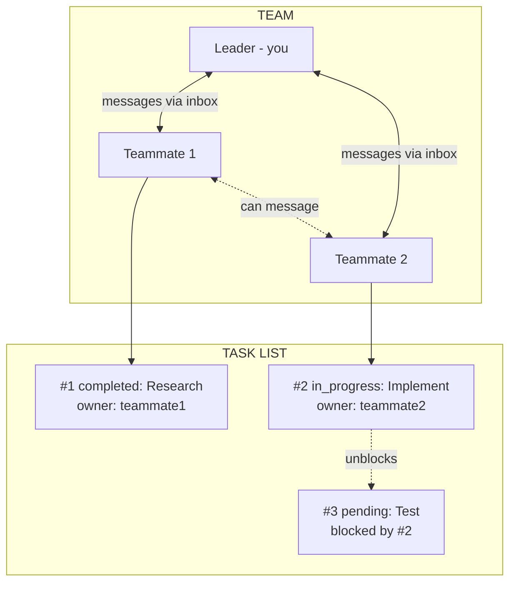
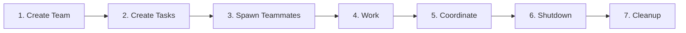
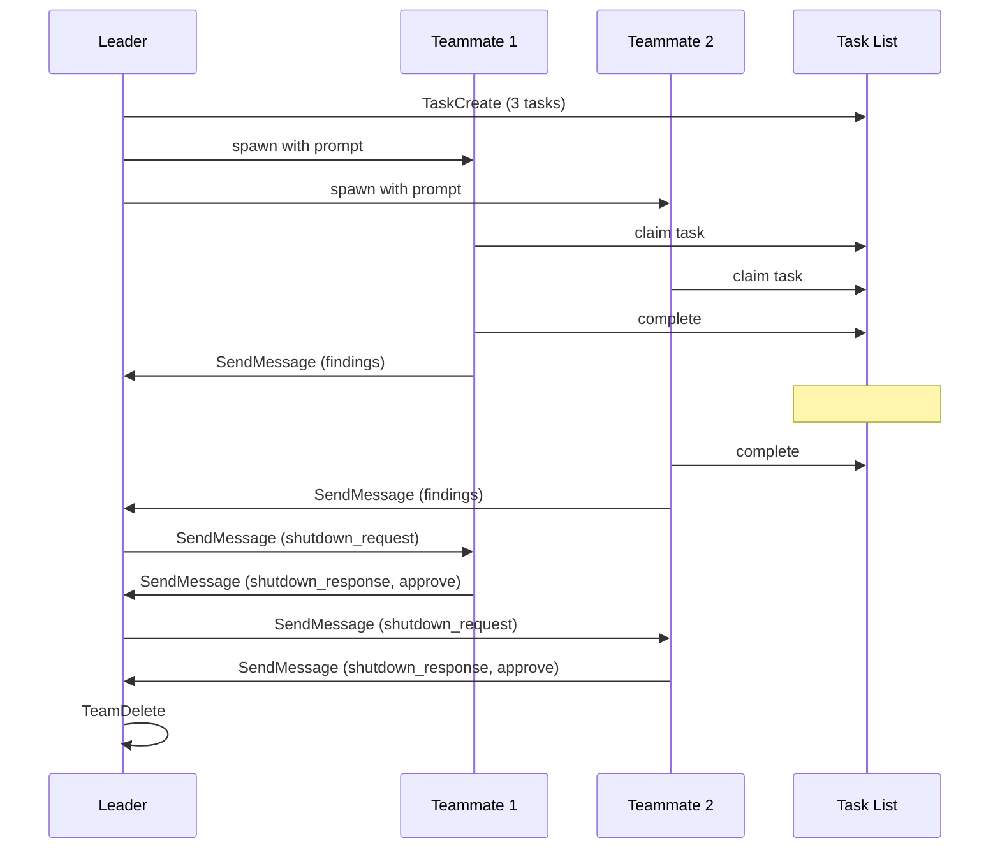

# Claude Code Swarm Orchestration

Master multi-agent orchestration using Claude Code's agent teams and task system.

> **Experimental**: Agent teams are disabled by default. Enable with `CLAUDE_CODE_EXPERIMENTAL_AGENT_TEAMS` in your [settings.json](https://code.claude.com/docs/en/settings) or environment.

---

## Primitives

| Primitive | What It Is | File Location |
|-----------|-----------|---------------|
| **Agent** | A Claude instance that can use tools. You are an agent. Subagents are agents you spawn. | N/A (process) |
| **Team** | A named group of agents working together. One leader, multiple teammates. | `~/.claude/teams/{name}/config.json` |
| **Teammate** | An agent that joined a team. Has a name, color, inbox. Spawned via Task with `team_name` + `name`. | Listed in team config |
| **Leader** | The agent that created the team. Receives teammate messages, approves plans/shutdowns. | First member in config |
| **Task** | A work item with subject, description, status, owner, and dependencies. | `~/.claude/tasks/{team}/N.json` |
| **Inbox** | JSON file where an agent receives messages from teammates. | `~/.claude/teams/{name}/inboxes/{agent}.json` |
| **Message** | A JSON object sent between agents. Can be text or structured (shutdown_request, idle_notification, etc). | Stored in inbox files |
| **Backend** | How teammates run. Auto-detected: `in-process` (same Node.js, invisible), `tmux` (separate panes, visible), `iterm2` (split panes in iTerm2). See [Spawn Backends](/skills/spawn-backends/). | Auto-detected based on environment |

### How They Connect



### Lifecycle



### Message Flow



---

## Sub-Skills Index

| Skill | What It Covers |
|-------|---------------|
| [Team Management](/skills/team-management/) | Create teams, spawn teammates, delegate mode, permissions, shutdown, cleanup |
| [Task System](/skills/task-system/) | TaskCreate, TaskList, TaskGet, TaskUpdate, dependencies, file locking |
| [Agent Types](/skills/agent-types/) | Built-in agents (Bash, Explore, Plan, general-purpose), plugin agents, selection guide |
| [Messaging](/skills/messaging/) | SendMessage (all types), message formats, automatic delivery, direct interaction |
| [Orchestration Patterns](/skills/orchestration-patterns/) | 7 patterns (parallel, pipeline, swarm, research, plan approval, refactoring, RLM) |
| [RLM Pattern](/skills/rlm-pattern/) | Content-aware chunked analysis of large files and directories using RLM pattern |
| [Spawn Backends](/skills/spawn-backends/) | in-process, tmux, iTerm2, teammateMode setting, auto-detection |
| [Error Handling](/skills/error-handling/) | Common errors, hooks (TeammateIdle, TaskCompleted), limitations, debugging |

---

## Quick Reference

### Create Team and Spawn Teammate
```javascript
TeamCreate({ team_name: "my-team", description: "Working on feature X" })
Task({ team_name: "my-team", name: "worker", subagent_type: "general-purpose", prompt: "...", run_in_background: true })
```

### Spawn Subagent (No Team)
```javascript
Task({ subagent_type: "Explore", description: "Find files", prompt: "..." })
```

### Message Teammate
```javascript
SendMessage({ type: "message", recipient: "worker-1", content: "...", summary: "Brief update" })
```

### Create Task Pipeline
```javascript
TaskCreate({ subject: "Step 1", description: "...", activeForm: "Working on step 1..." })
TaskCreate({ subject: "Step 2", description: "...", activeForm: "Working on step 2..." })
TaskUpdate({ taskId: "2", addBlockedBy: ["1"] })
```

### Shutdown Team
```javascript
SendMessage({ type: "shutdown_request", recipient: "worker-1", content: "All done" })
// Wait for approval...
TeamDelete()
```

---

*Based on Claude Code agent teams documentation - Updated 2026-02-07*
