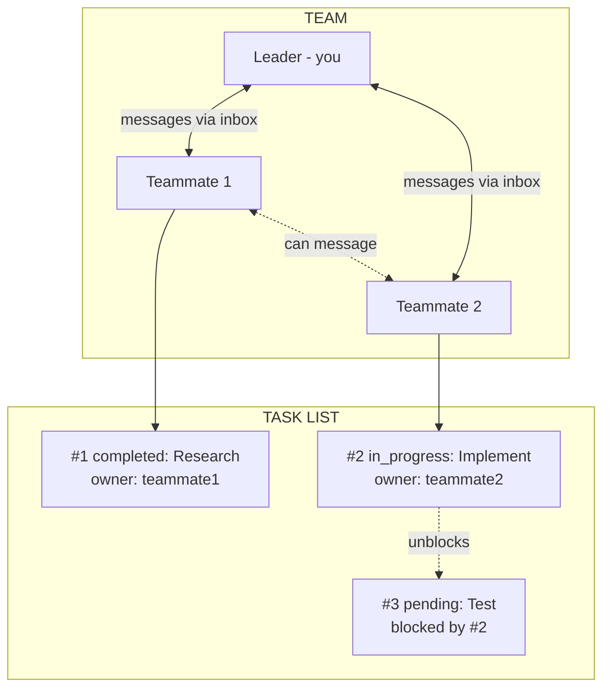
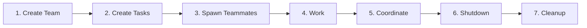
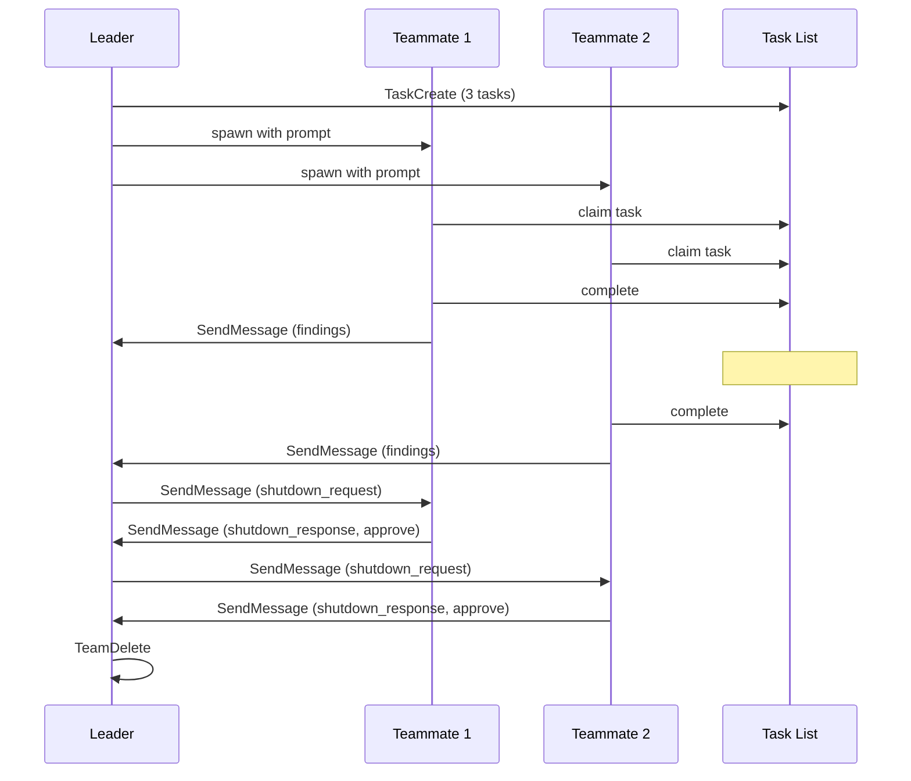

# Claude Code Swarm Orchestration

Master multi-agent orchestration using Claude Code's agent teams and task system.

> **Experimental**: Agent teams are disabled by default. Enable with `CLAUDE_CODE_EXPERIMENTAL_AGENT_TEAMS` in your [settings.json](https://code.claude.com/docs/en/settings) or environment.

---

## Primitives

| Primitive | What It Is | File Location |
|-----------|-----------|---------------|
| **Agent** | A Claude instance that can use tools. You are an agent. Subagents are agents you spawn. | N/A (process) |
| **Team** | A named group of agents working together. One leader, multiple teammates. | `~/.claude/teams/{name}/config.json` |
| **Teammate** | An agent that joined a team. Has a name, color, inbox. Spawned via Task with `team_name` + `name`. | Listed in team config |
| **Leader** | The agent that created the team. Receives teammate messages, approves plans/shutdowns. | First member in config |
| **Task** | A work item with subject, description, status, owner, and dependencies. | `~/.claude/tasks/{team}/N.json` |
| **Inbox** | JSON file where an agent receives messages from teammates. | `~/.claude/teams/{name}/inboxes/{agent}.json` |
| **Message** | A JSON object sent between agents. Can be text or structured (shutdown_request, idle_notification, etc). | Stored in inbox files |
| **Backend** | How teammates run. Auto-detected: `in-process` (same Node.js, invisible), `tmux` (separate panes, visible), `iterm2` (split panes in iTerm2). See [Spawn Backends](../spawn-backends/SKILL.md). | Auto-detected based on environment |

### How They Connect



### Lifecycle



### Message Flow



---

## Sub-Skills Index

| Skill | What It Covers |
|-------|---------------|
| [Team Management](../team-management/SKILL.md) | Create teams, spawn teammates, delegate mode, permissions, shutdown, cleanup |
| [Task System](../task-system/SKILL.md) | TaskCreate, TaskList, TaskGet, TaskUpdate, dependencies, file locking |
| [Agent Types](../agent-types/SKILL.md) | Built-in agents (Bash, Explore, Plan, general-purpose), plugin agents, selection guide |
| [Messaging](../messaging/SKILL.md) | SendMessage (all types), message formats, automatic delivery, direct interaction |
| [Orchestration Patterns](../orchestration-patterns/SKILL.md) | 7 patterns (parallel, pipeline, swarm, research, plan approval, refactoring, RLM) |
| [RLM Pattern](../rlm-pattern/SKILL.md) | Content-aware chunked analysis of large files and directories using RLM pattern |
| [Spawn Backends](../spawn-backends/SKILL.md) | in-process, tmux, iTerm2, teammateMode setting, auto-detection |
| [Error Handling](../error-handling/SKILL.md) | Common errors, hooks (TeammateIdle, TaskCompleted), limitations, debugging |

---

## Quick Reference

### Create Team and Spawn Teammate
```javascript
TeamCreate({ team_name: "my-team", description: "Working on feature X" })
Task({ team_name: "my-team", name: "worker", subagent_type: "general-purpose", prompt: "...", run_in_background: true })
```

### Spawn Subagent (No Team)
```javascript
Task({ subagent_type: "Explore", description: "Find files", prompt: "..." })
```

### Message Teammate
```javascript
SendMessage({ to: "worker-1", message: "...", summary: "Brief update" })
```

### Create Task Pipeline
```javascript
TaskCreate({ subject: "Step 1", description: "...", activeForm: "Working on step 1..." })
TaskCreate({ subject: "Step 2", description: "...", activeForm: "Working on step 2..." })
TaskUpdate({ taskId: "2", addBlockedBy: ["1"] })
```

### Shutdown Team
```javascript
SendMessage({ to: "worker-1", message: { type: "shutdown_request", reason: "All done" } })
// Wait for approval...
TeamDelete()
```

---

## Skill Frontmatter Reference

Every skill's `SKILL.md` starts with YAML frontmatter. `name` and `description` are required; all other fields are optional.

| Field | Type | Description |
|-------|------|-------------|
| `name` | string | **Required.** Identifier used to invoke the skill |
| `description` | string | **Required.** Shown in autocomplete and used by Claude to select the skill |
| `argument-hint` | string | Hint shown during autocomplete (e.g. `"[file path or query]"`) |
| `user-invocable` | boolean | When `false`, hides from the `/` menu; skill is background knowledge for Claude only (default: `true`) |
| `disable-model-invocation` | boolean | When `true`, Claude won't auto-load this skill; user must invoke via `/` menu |
| `allowed-tools` | string | Restrict tool access when skill is active (e.g. `"Read, Grep, Glob"`) |
| `model` | string | Model override when skill is active (e.g. `"haiku"`, `"sonnet"`) |
| `context` | string | Set to `"fork"` to run skill in an isolated subagent context |
| `agent` | string | Subagent type to use when `context: fork` (e.g. `"Explore"`, `"general-purpose"`) |
| `hooks` | object | Lifecycle hooks scoped to this skill |

### String Substitutions

Use these placeholders in your skill content to inject runtime values:

| Substitution | Value |
|-------------|-------|
| `$ARGUMENTS` | Full user input passed to the skill |
| `$ARGUMENTS[N]` / `$N` | Nth space-separated argument (1-indexed) |
| `${CLAUDE_SESSION_ID}` | Current Claude session ID |
| `${CLAUDE_SKILL_DIR}` | Absolute path to the directory containing this skill's SKILL.md |

### Dynamic Context Injection

Use `` !`command` `` syntax to execute a shell command and inject its output as context when the skill loads:

```yaml
context: !`cat ${CLAUDE_SKILL_DIR}/extra-context.md`
```

### Example: Isolated Subagent Skill

```yaml
---
name: my-explorer
description: Explore codebase for patterns
user-invocable: true
argument-hint: "[pattern or question]"
context: fork
agent: Explore
---
```

When `context: fork` is set, Claude spawns a fresh subagent of type `agent` to handle the skill invocation, keeping the main context clean.

---

*Based on Claude Code agent teams documentation - Updated 2026-02-07*
