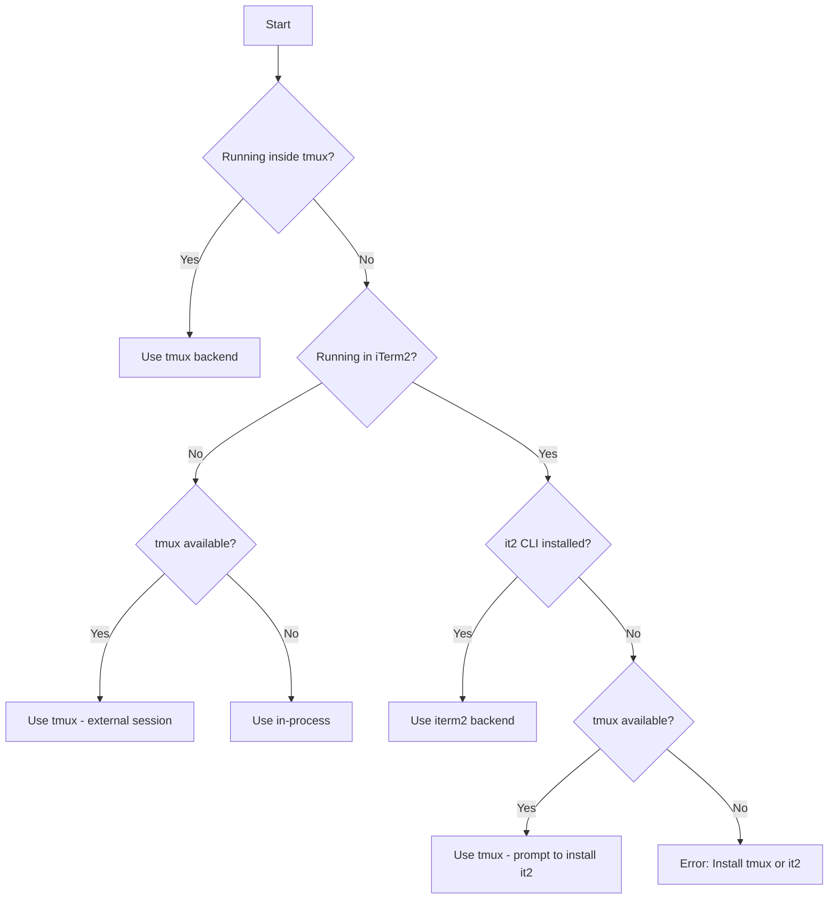

# Spawn Backends

A **backend** determines how teammate Claude instances actually run. Claude Code supports three backends and **auto-detects** the best one based on your environment.

> **Experimental:** Agent teams are disabled by default. Enable with `CLAUDE_CODE_EXPERIMENTAL_AGENT_TEAMS` in your settings or environment.

**Related skills:**
- [Orchestrating](../orchestrating/SKILL.md) - Primitives overview and quick reference
- [Team Management](../team-management/SKILL.md) - Creating and managing teams
- [Error Handling](../error-handling/SKILL.md) - Troubleshooting backend issues

---

## Backend Comparison

| Backend | How It Works | Visibility | Persistence | Speed |
|---------|-------------|------------|-------------|-------|
| **in-process** | Same Node.js process as leader | Hidden (background) | Dies with leader | Fastest |
| **tmux** | Separate terminal in tmux session | Visible in tmux | Survives leader exit | Medium |
| **iterm2** | Split panes in iTerm2 window | Visible side-by-side | Dies with window | Medium |

---

## teammateMode Setting

The default is `"auto"`, which uses split panes if you're already running inside a tmux session, and in-process otherwise.

### Settings File Configuration

Set `teammateMode` in your [settings.json](https://code.claude.com/docs/en/settings):

```json
{
  "teammateMode": "in-process"
}
```

Valid values: `"auto"`, `"in-process"`, `"tmux"`

### CLI Flag

Force a mode for a single session:

```bash
claude --teammate-mode in-process
```

### Environment Variable

```bash
export CLAUDE_CODE_SPAWN_BACKEND=in-process
```

---

## Auto-Detection Logic

Claude Code automatically selects a backend using this decision tree:



**Detection checks:**
1. `$TMUX` environment variable -> inside tmux
2. `$TERM_PROGRAM === "iTerm.app"` or `$ITERM_SESSION_ID` -> in iTerm2
3. `which tmux` -> tmux available
4. `which it2` -> it2 CLI installed

---

## in-process (Default)

Teammates run as async tasks within the same Node.js process.

**How it works:**
- No new process spawned
- Teammates share the same Node.js event loop
- Communication via in-memory queues (fast)
- You don't see teammate output directly

**When it's used:**
- Not running inside tmux session
- Non-interactive mode (CI, scripts)
- Explicitly set via `teammateMode: "in-process"` or `CLAUDE_CODE_SPAWN_BACKEND=in-process`

**Layout:**
```
┌─────────────────────────────────────────┐
│           Node.js Process               │
│  ┌─────────┐  ┌─────────┐  ┌─────────┐ │
│  │ Leader  │  │Worker 1 │  │Worker 2 │ │
│  │ (main)  │  │ (async) │  │ (async) │ │
│  └─────────┘  └─────────┘  └─────────┘ │
└─────────────────────────────────────────┘
```

**Interaction:** Use **Shift+Up/Down** to select a teammate, then type to send a message. Press **Enter** to view a session, **Escape** to interrupt, **Ctrl+T** to toggle the task list.

**Pros:**
- Fastest startup (no process spawn)
- Lowest overhead
- Works everywhere, no extra setup

**Cons:**
- Can't see teammate output in real-time
- All die if leader dies
- Harder to debug

---

## tmux

Teammates run as separate Claude instances in tmux panes/windows.

**How it works:**
- Each teammate gets its own tmux pane
- Separate process per teammate
- You can switch panes to see teammate output
- Communication via inbox files

**When it's used:**
- Running inside a tmux session (`$TMUX` is set)
- tmux available and not in iTerm2
- Explicitly set via `teammateMode: "tmux"` or `CLAUDE_CODE_SPAWN_BACKEND=tmux`

**Layout modes:**

1. **Inside tmux (native):** Splits your current window
```
┌─────────────────┬─────────────────┐
│                 │    Worker 1     │
│     Leader      ├─────────────────┤
│   (your pane)   │    Worker 2     │
│                 ├─────────────────┤
│                 │    Worker 3     │
└─────────────────┴─────────────────┘
```

2. **Outside tmux (external session):** Creates a new tmux session called `claude-swarm`
```bash
# Your terminal stays as-is
# Workers run in separate tmux session

# View workers:
tmux attach -t claude-swarm
```

> **Note:** tmux has known limitations on certain operating systems and traditionally works best on macOS. Using `tmux -CC` in iTerm2 is the suggested entrypoint.

**Pros:**
- See teammate output in real-time
- Teammates survive leader exit
- Can attach/detach sessions
- Works in CI/headless environments

**Cons:**
- Slower startup (process spawn)
- Requires tmux installed
- More resource usage

```bash
# Start tmux session first
tmux new-session -s claude

# Or force tmux backend
export CLAUDE_CODE_SPAWN_BACKEND=tmux
```

**Useful tmux commands:**
```bash
# List all panes in current window
tmux list-panes

# Switch to pane by number
tmux select-pane -t 1

# Kill a specific pane
tmux kill-pane -t %5

# View swarm session (if external)
tmux attach -t claude-swarm

# Rebalance pane layout
tmux select-layout tiled
```

---

## iterm2 (macOS only)

Teammates run as split panes within your iTerm2 window.

**How it works:**
- Uses iTerm2's Python API via `it2` CLI
- Splits your current window into panes
- Each teammate visible side-by-side
- Communication via inbox files

**When it's used:**
- Running in iTerm2 (`$TERM_PROGRAM === "iTerm.app"`)
- `it2` CLI is installed and working
- Python API enabled in iTerm2 preferences

**Layout:**
```
┌─────────────────┬─────────────────┐
│                 │    Worker 1     │
│     Leader      ├─────────────────┤
│   (your pane)   │    Worker 2     │
│                 ├─────────────────┤
│                 │    Worker 3     │
└─────────────────┴─────────────────┘
```

**Pros:**
- Visual debugging - see all teammates
- Native macOS experience
- No tmux needed
- Automatic pane management

**Cons:**
- macOS + iTerm2 only
- Requires setup (it2 CLI + Python API)
- Panes die with window
- Not supported in VS Code's integrated terminal, Windows Terminal, or Ghostty

**Setup:**
```bash
# 1. Install it2 CLI
uv tool install it2
# OR
pipx install it2
# OR
pip install --user it2

# 2. Enable Python API in iTerm2
# iTerm2 -> Settings -> General -> Magic -> Enable Python API

# 3. Restart iTerm2

# 4. Verify
it2 --version
it2 session list
```

**If setup fails:** Claude Code will prompt you to set up it2 when you first spawn a teammate. You can choose to:
1. Install it2 now (guided setup)
2. Use tmux instead
3. Cancel

---

## Backend in Team Config

The backend type is recorded per-teammate in `config.json`:

```json
{
  "members": [
    {
      "name": "worker-1",
      "backendType": "in-process",
      "tmuxPaneId": "in-process"
    },
    {
      "name": "worker-2",
      "backendType": "tmux",
      "tmuxPaneId": "%5"
    }
  ]
}
```

---

## Checking Current Backend

```bash
# See what backend was detected
cat ~/.claude/teams/{team}/config.json | jq '.members[].backendType'

# Check if inside tmux
echo $TMUX

# Check if in iTerm2
echo $TERM_PROGRAM

# Check tmux availability
which tmux

# Check it2 availability
which it2
```

---

## Troubleshooting Backends

| Issue | Cause | Solution |
|-------|-------|----------|
| "No pane backend available" | Neither tmux nor iTerm2 available | Install tmux: `brew install tmux` |
| "it2 CLI not installed" | In iTerm2 but missing it2 | Run `uv tool install it2` |
| "Python API not enabled" | it2 can't communicate with iTerm2 | Enable in iTerm2 Settings -> General -> Magic |
| Workers not visible | Using in-process backend | Start inside tmux or iTerm2 |
| Workers dying unexpectedly | Outside tmux, leader exited | Use tmux for persistence |
| Orphaned tmux sessions | Team wasn't fully cleaned up | `tmux ls` then `tmux kill-session -t <name>` |
